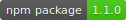

# Read me

[Example of use](https://joseantoniolpz.github.io/lpzJS/examples)

The development of lpzJS is non-profit, however you can evaluate to donate if the project help you. This gesture help us a lot.
[Donate for the project](https://www.paypal.com/cgi-bin/webscr?cmd=_s-xclick&hosted_button_id=QVT9FUB3ABCJS&source=url)

This library is in a early stage of his development, if you find a bug, please tell us for fixed it.

If you do a new funcionality or improve some of the current maybe you are interesented in add to the repository, you are free to do or not. If you do, you help this project and someone that need it.

Until now, this library support:

- [Graph](docs/doc_en_En.md#graph)
- [Progress Bar](docs/doc_en_En.md#progress-bar)
- [Timer](docs/doc_en_En.md#timer)
- [Navigation utilities](docs/doc_en_En.md#navigation-utilities)
- [¿How to use Ajax?](docs/doc_en_En.md#ajax)

# Documentation

- [English documentation](docs/doc_en_En.md)
- [Documentación en español](docs/doc_es_Es.md)

# Task List v1.2

- Improvement:
	- [ ] Hover events in graphic
	- [ ] Responsive:
		- [X] Bar graph
		- [ ] Circle graph
		- [ ] Lineal graph
		- [ ] Lineal progress bar
		- [ ] Circle progress bar
		- [ ] Semi-circular progress bar
	- [ ] Improve drop-down menu
	- [ ] Try progressBar with AJAX
- Add funcionality
	- [ ] Bottom menu in nav_lpz.js
- [ ] DOC v1.2
	
# Collaborators

- [@ocewen](https://github.com/ocewen) -> Develop and testing :heart:
