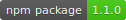
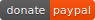

# Documentation

[](https://www.mit.edu/~amini/LICENSE.md)
[](https://www.npmjs.com/package/@joseantoniolpz/lpzjs)
[](https://www.javascript.com/)
[](https://www.paypal.com/cgi-bin/webscr?cmd=_s-xclick&hosted_button_id=QVT9FUB3ABCJS&source=url)

[Example of use](https://joseantoniolpz.github.io/lpzJS/examples)

The development of lpzJS is non-profit, however you can evaluate to donate if the project help you. This gesture help us a lot.
[Donate for the project](https://www.paypal.com/cgi-bin/webscr?cmd=_s-xclick&hosted_button_id=QVT9FUB3ABCJS&source=url)

This library is in a early stage of his development, if you find a bug, please tell us for fixed it.

If you do a new funcionality or improve some of the current, maybe, you are interesented in add to the repository, you are free to do or not. If you do, you help this project and someone that need it.

Until now, this library support:

- [Graph](#graph)
- [Progress Bar](#progress-bar)
- [Timer](#timer)
- [Navigation utilities](#navigation-utilities)
- [¿How to use Ajax?](#ajax)

## Instalation

You can install this library downloading this repository and importing the JS files in your project, also you can download the repository via *npm* by:

- Command line:
```BASH
npm install @joseantoniolpz/lpzjs@1.0.4
```

- A file **package.json**
```JSON
{
	"dependencies": {
		"@joseantoniolpz/lpzjs": "1.0.4"
	}
}

```

A folder will be downloaded called *node-modules*.

_optionally_: Extract the JS files and import in your project, later, delete the rest of the folder to save space in your project.

## Graph

You can draw different types of graphics using this library:

- [Bar graph](#bar-graph)
- [Circle graph](#circle-graph)
- [Lineal graph](#lineal-graph)

### Bar graph

For create a bar graph, you will need to add a element **canvas** with the class *graphic_bar_lpz* in your HTML document, we recommended to establish a widht and height that suits yours needs.

For draw the graph, we have to pass a JSON, for that, we use the atribute *data-json*, the structure is as follow:

```
	[
		{
			"name": "{string}",
			"value": {int}
		},
		{
			"name": "{string}",
			"value": {int}
		}, 
		... 
		{
			"name": "{string}",
			"value": {int}
		}
	]
```	

We can pass aditional atributes for customize our graph, this is the optional atributes:

- data-min -> Set the minimun width of the bars (by default, it´s calculated automatically).
- data-max -> Set the maximun width of the bars (by default, it´s calculated automatically).
- data-sep -> Set the separation between the bars (by default, it´s calculated automatically).
- data-color -> Set the bars' color (by default *blue*).
- data-valcol -> Set the value's color (by default *white*).
- data-title -> Set a title to the graph (by default *empty*).
- data-sbs -> Set the column name´s maximum character.
- data-bcolor -> Set the delimiter line´s color (by default *black*).
- data-lline -> Show the left delimiter line, if the values is 1, the line is show, if it´s 0 no (by default *1*).
- data-bline -> Show the bottom delimiter line, if the values is 1, the line is show, if it´s 0 no(by default *1*).

Here an example of a complete canvas element:
```html
<canvas class='graphic_bar_lpz' width='500' height='300' data-json='[{"name":
"January","value":100},{"name":"Febrary","value":300},{"name":"March","value":200}
,{"name":"April","value":200},{"name":"May","value":400},{"name":"June",
"value":200}]' data-min='20' data-max='40' data-sep="15" data-color='blue' 
data-valcol='white' data-title='Cherries per square meter' data-bcolor='red' 
data-lline='1' data-bline='1' data-sbs="6"></canvas>

<canvas class='graphic_bar_lpz' width='500' height='300' data-json='[{"name":
"January","value":100},{"name":"Febrary","value":300},{"name":"March","value":200}
,{"name":"April","value":200},{"name":"May","value":400},{"name":"June",
"value":200}]'data-color='green' data-valcol='white' data-title='Cherries per square meter' 
data-bcolor='red' data-lline='0' data-sbs="20"></canvas>
```

### Circle graph

For create a circle graph, you will need to add a element **canvas** with the class *circle_lpz* in your HTML document, we recommended to establish a widht and height that suits yours needs, we should give the same value to the height and width (Square canvas).

For draw the graph, we have to pass a JSON, for that, we use the atribute *data-json*, the structure is as follow:

```
	[
		{
			"name": "{string}",
			"value": {int},
			"color": "{string}"
		},
		{
			"name": "{string}",
			"value": {int},
			"color": "{string}"
		}, 
		... 
		{
			"name": "{string}",
			"value": {int},
			"color": "{string}"
		}
	]
```	

We can pass aditional atributes for customize our graph, this is the optional atributes:

- data-title -> Set a title to the graph (by default *empty*).

Here an example of a complete canvas element:

```html
<canvas class='circle_lpz' width='300' height='300' data-json='[{"name":"January","value":400, 
"color": "red"},{"name":"Febrary","value":300, "color": "blue"},{"name":"March","value":200, 
"color": "green"},{"name":"April","value":200, "color": "yellow"},{"name":"May","value":333, 
"color": "orange"}]' data-title='Cherries per square meter'></canvas>
```
### Lineal graph

For create a bar graph, you will need to add a element **canvas** with the class *graphic_lpz* in your HTML document, we recommended to establish a widht and height that suits yours needs.

For draw the graph, we have to pass a JSON, for that, we use the atribute *data-json*, the structure is as follow:

```
	[
		{
			"name": "{string}",
			"value": {int}
		},
		{
			"name": "{string}",
			"value": {int}
		}, 
		... 
		{
			"name": "{string}",
			"value": {int}"
		}
	]
```

We can pass aditional atributes for customize our graph, this is the optional atributes:

- data-sep -> Set the separation between the bars (by default *10*).
- data-color -> Set the bars' color (by default *blue*).
- data-title -> Set a title to the graph (by default *empty*).

Here an example of a complete canvas element:

```html
<canvas class='graphic_lpz' width='500' height='200' data-json='[{"name":"January","value":100},
{"name":"Febrary","value":300},{"name":"March","value":200},{"name":"April","value":200},
{"name":"May","value":400},{"name":"June","value":125},{"name":"July","value":50},
{"name":"August","value":150}]' data-sep='55' data-title='Cherries per square meter' 
data-color='blue'></canvas>
```

## Progress Bar

You can draw different types of progress bar using this library:

- [Lineal progress bar](#lineal-progress-bar)
- [Circle progress bar](#circle-progress-bar)
- [Semi-circular progress bar](#semi-circular-progress-bar)

### Lineal progress bar

For create a lineal progress bar, you will need to add a element **canvas** with the class *progress_bar_lpz* in your HTML document, we recommended to establish a widht and height that suits yours needs (A small height is recommended).

For draw the bar, we need to pass it a percentage and text, for that we use:

- data-percent -> We must to pass a integer number (for example 25).
- data-text -> We must to pass a String (for example Strength).

We can pass aditional atributes for customize our graph, this is the optional atributes:

- data-ctext -> Set the text's color (By default *black*).
- data-color -> Set the bars' color (By default *cyan*).
- data-cpercent -> Set the percentage´s color (By default *black*).
- data-font -> Set the text's font (By default *10px Arial*).

Here an example of a complete canvas element:

```html
<canvas class='progress_bar_lpz' width='200' height='20' data-text='Strength' data-percent='25' 
data-color='green' data-ctext='white' data-cpercent='black' data-font='10px Arial'></canvas>
```

### Circle progress bar

For create a lineal progress bar, you will need to add a element **canvas** with the class *progress_circle_lpz* in your HTML document, we recommended to establish a widht and height that suits yours needs, we should give the same value to the height and width (Square canvas).

For draw the bar, we need to pass it a percentage and text, for that we use:

- data-percent -> We must to pass a integer number (for example 60).
- data-text -> We must to pass a String (for example Strength).

We can pass aditional atributes for customize our graph, this is the optional atributes:

- data-bulk -> Set the circle´s thickness (By default *5*).
- data-color -> Set the circle´s color (By default *blue*).
- data-cfont -> Set the font's color (By default *black*).
- data-mostrate -> establece la manera de visualizar los resultados, pueden tomar los siguientes valores (By default *0*).
	- 0 -> Show the text and the percentage
	- 1 -> Show the percentage
	- 2 -> Show the text
	- 3 -> Not show nothing
- data-font -> Set the text´s font (By default *10px Arial*).

Here an example of a complete canvas element:

```html
<canvas class='progress_circle_lpz' width='100' height='100' data-text='Strength' 
data-percent='60' data-color='red' data-font='20px Arial' data-bulk='5' data-mostrate='1'></canvas>
```

### Semi-circular progress bar

For create a lineal progress bar, you will need to add a element **canvas** with the class *progress_half_circle_lpz* in your HTML document, we recommended to establish a widht and height that suits yours needs, we should give the same value to the height and width (Square canvas).

For draw the bar, we need to pass it a percentage and text, for that we use:

- data-percent -> We must to pass a integer number (for example 60).
- data-text -> We must to pass a String (for example Strength).

We can pass aditional atributes for customize our graph, this is the optional atributes:

- data-bulk -> Set the circle´s thickness (By default *5*).
- data-color -> Set the circle´s color (By default *blue*).
- data-cfont -> Set the font's color (By default *black*).
- data-mostrate -> set the way to visualize the results (By default *0*).
	- 0 -> Show the text and the percentage
	- 1 -> Show the percentage
	- 2 -> Show the text
	- 3 -> Not show nothing
- data-font -> Set the text´s font (By default *10px Arial*).

Here an example of a complete canvas element:

```html
<canvas class='progress_half_circle_lpz' width='100' height='100' data-text='Strength' 
data-percent='60' data-color='red' data-font='20px Arial' data-bulk='5' data-mostrate='1'></canvas>
```

## Timer

For create a timer, you will need to add a element **canvas** with the class *timer_lpz* in your HTML document, we recommended to establish a widht and height that suits yours needs.

For draw the timer, we need to pass it a date, for that we use:

- data-time -> We must to pass a date in format yyyy-MM-dd (for example 2020-11-24).

We can pass aditional atributes for customize our graph, this is the optional atributes:

- data-format -> set the format to visualize the results (By default *0*).
	- 0 -> Show the data with days. (For example 345 days 15:26:08).
	- 1 -> Show the data without days. (For example 2158:26:08).
- data-font -> Set the text´s font (By default *10px Arial*).

Here an example of a complete canvas element:


```html
<canvas class='timer_lpz' width='200' height='50' data-time='2020-11-24' 
data-font='20px Bangers' data-format='0'></canvas>
```

## Navigation utilities

lpzJS offers different utilities for navigate into our site:

- [Drop-down Menu](#drop-down-menu)
- [Button to Top](#button-to-top)
- [Multiple button](#multiple-button)

### Drop-down Menu

For create a drop-down menu, you will need to add a element **div** with the **id**: *nav_lpz* in your HTML document.

We can pass aditional atributes for customize our drop-down menu, this is the optional atributes:

- data-width -> Set the menu's width (By default *75%* of the screen).
- data-cnav -> Set the menu's background color (By default *white*).
- data-chover -> Set the element´s color when we hover over it (By default *white*).
- data-sep -> Set the menu element's left separation (By default *10px*).
- data-fcolor -> Set the element's font color (By default *blue*).

Inside of this div, we can add another 3 different divs with the next *classes*:

- logo_lpz -> Designed for the menu's top part, we can customize our logo with the next atributes:
	- data-clogo -> Set the logo's background color.
	- data-img -> Set the logo's background image.
- sup_lpz -> Designed for the menu's middle part, here we add our links.
- inf_lpz -> Designed for the menu's bottom part, here we add our links.

For open and close the menu is use two elements, of any type (we recommended *div*), with the next *id*: 

- open_lpz -> Open the drop-down menu.
	- data-img -> Set the button's background image.
	- data-width -> Set thw button's width (By default *50px*).
	- data-height ->Set thw button's height (By default *50px*).
- close_lpz -> Close the drop-down menu.
	- data-img ->Set the button's background image.
	- data-width -> Set thw button's width (By default *50px*).
	- data-height ->Set thw button's height (By default *50px*).

We can position this buttons where we want in our DOM.

It's normal that the elements of drop-drown menus have icons, we can add icons using CSS selectors, here we put a example to do it:

```css
/* SET A ICON FROM FONT AWESOME FOR EVERY ELEMENTS OF THE MENU*/
#nav_lpz a{
	position: relative;
}

#nav_lpz a:before{
	font-family: FontAwesome;
	content:"\f007";
	position: absolute;
	left: 2px;
}
```

Here an example of a complete canvas element:

```html
<div id="nav_lpz" data-width="300px" data-cnav="white" data-chover="#aeea7c" 
data-sep="15px" data-fcolor="black">
		<div class="logo_lpz" data-clogo="#aeea7c" data-img='images/flor.jpg'>
			<div id="close_lpz" data-img='images/equis.png' data-width='50px' 
			data-height='50px'></div>
		</div>
		<div class="sup_lpz">
			<a href="#">Link 1</a>
			<a href="#">Link 2</a>
			<a href="#">Link 3</a>
		</div>
		<div class="inf_lpz">
			<a href="#">Link 4</a>
			<a href="#">Link 5</a>
		</div>
	</div>

	<div id="open_lpz" data-img='images/open.png' data-width='50px' 
	data-height='50px'></div>
```

### Button to Top

For create a button to top, you will need to add a element **div** with the **id**: *top_but_lpz* in your HTML document.

We can pass aditional atributes for customize our button, this is the optional atributes:

- data-color -> Set de button's color (By default *orange*).
- data-width -> Set the width, because it´s a circle, set also the height (By default *50px*).
- data-vel -> Set the animation's velocity of the action (By default *150*).
- data-img -> Set the button's background image.

We can position our button in the screen using the next atributes (keeping in mind that the position 0,0 is the lower right corner):

- data-posx -> X position in the screen (By default: *20px*).
- data-posy -> Y position in the screen (By default: *20px*).

Here an example of a complete canvas element:

```html
<div id="top_but_lpz" data-color="blue" data-width='50px' data-vel='150' 
data-img='images/paloma.png' data-posx='100px' data-posy='20px'></div>
```

### Multiple button

For create a multiple button, you will need to add a element **div** with the id *multi_but_lpz* in your HTML document, later, we must create childrens elements (_inside of the div_) of type **a**.

We can pass aditional atributes for customize our button, this is the optional atributes:

- data-width -> Set the width, because it´s a circle, set also the height (By default *50px*).
- data-color -> Set de button's color (By default *orange*).
- data-img -> Set the button's background image.

We can position our button in the screen using the next atributes(Keeping in mind that the position 0,0 is the lower right corner):

- data-posx -> X position in the screen (By default: *20px*).
- data-posy -> Y position in the screen (By default: *20px*).

We can set backgrounds images for our links using the atribute:

- data-img -> Set the button's background image.

Here an example of a complete canvas element:

```html
<div id="multi_but_lpz" data-color="green" data-img='images/paloma.png' 
data-posx='20px' data-posy='20px'>
	<a href="#" data-img='images/paloma.png'></a>
	<a href="#" data-img='images/open.png'></a>
	<a href="#" data-img='images/equis.png'></a>
</div>
```

## AJAX

We can create and update our canvas elements using AJAX:

For now support (Coming soon, we add support for the rest of the canvas elements):

- graphic.js
- graphic.min.js
- lpz.js (Only the graphic part)
- lpz.min.js (Only the graphic part)

To create a new element, we must be do a AJAX petition for obtain a JSON with the adequate structure (Show the element documentation), then, we must be add the new canvas element using JS/Jquery (It´s recommended to establish a ID), we must be concatenate the JSON in the *data-json*, keeping in mind that, we need to transform the JSON to String unsing the function *JSON.stringify*, then, we must be call the correspondant function.

Here an example:

```JavaScript
// JQUERY EXAMPLE

// Add a new element using AJAX

$.ajax({
	method: "GET",
	url: "http://localhost:8079/proyectos/pruebas/lpzJS/examples/j.json",
	dataType: "json"
}).done(function(data){
	var string = "<canvas id='pp' class='circle_lpz' width='300' height='300' data-json='" + JSON.stringify(data) + "' data-title='cerezas por metro cuadrado'></canvas>";
	let canvas = $(string); // The canvas is created
	$("#top_but_lpz").before(canvas); // The canvas is added in the DOM
}).fail(function(){
	console.log("fail");
}).always(function(){
	let canvas = document.getElementById('pp'); // Even if we use Jquery, selecting the element with JS will avoid problems
	circle(canvas); // call the draw function
});
```

To update a element, we must be do a AJAX petition for obtain a JSON with the adequate structure (Show the element documentation), then, we need to update the *data-json* atributte (It is recommended to have given our canvas an ID to select it), keeping in mind that, we need to transform the JSON to String unsing the function *JSON.stringify*, then, we must be call the correspondant function.

Here an example:

```JavaScript
// Update a element using AJAX

$.ajax({
	method: "GET",
	url: "http://localhost:8079/proyectos/pruebas/lpzJS/examples/u.json",
	dataType: "json"
}).done(function(data){
	$('#circle').attr('data-json', JSON.stringify(data)); // Update json-data
}).fail(function(){
	console.log("fail");
}).always(function(){
	let canvas = document.getElementById('circle'); // Even if we use Jquery, selecting the element with JS will avoid problems
	circle(canvas); // call the draw function
});
```

Here, we list the differents functions for the canvas elements:

- Graphics:
	- Graphic: graphic(canvas);
	- Graphic bar: graphicBar(canvas);
	- Circle graphic: circle(canvas);
- ProgressBar: Coming soon