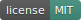

# Documentation

[](https://www.mit.edu/~amini/LICENSE.md)
[](https://www.npmjs.com/package/@joseantoniolpz/lpzjs)
[](https://www.javascript.com/)
[](https://www.paypal.com/cgi-bin/webscr?cmd=_s-xclick&hosted_button_id=QVT9FUB3ABCJS&source=url)

[Example of use](https://joseantoniolpz.github.io/lpzJS/examples)

The development of lpzJS is non-profit, however you can evaluate to donate if the project help you. This gesture help us a lot.
[Donate for the project](https://www.paypal.com/cgi-bin/webscr?cmd=_s-xclick&hosted_button_id=QVT9FUB3ABCJS&source=url)

This library is in a early stage of his development, if you find a bug, please tell us for fixed it.

If you do a new funcionality or improve some of the current, maybe, you are interesented in add to the repository, you are free to do or not. If you do, you help this project and someone that need it.

Until now, this library support:

- [Graph](#graph)
- [Progress Bar](#progress-bar)
- [Timer](#timer)
- [Navigation utilities](#navigation)

## Instalation

You can install this library downloading this repository and importing the JS files in your project, also you can download the repository via *npm* by:

- Command line:
```BASH
npm install @joseantoniolpz/lpzjs@1.0.4
```

- A file **package.json**
```JSON
{
	"dependencies": {
		"@joseantoniolpz/lpzjs": "1.0.4"
	}
}

```

A folder will be downloaded called *node-modules*.

_optionally_: Extract the JS files and import in your project, later, delete the rest of the folder to save space in your project.

## Graph

You can draw different types of graphics using this library:

- [Bar graph](#bar-graph)
- [Circle graph](#circle-graph)
- [Lineal graph](#lineal-graph)

### Bar graph

For create a bar graph, you will need to add a element **canvas** with the class *graphic_bar_lpz* in your HTML document, we recommended to establish a widht and height that suits yours needs.

For draw the graph, we have to pass a JSON, for that, we use the atribute *data-json*, the structure is as follow:

```
	[
		{
			"name": "{string}",
			"value": {int}
		},
		{
			"name": "{string}",
			"value": {int}
		}, 
		... 
		{
			"name": "{string}",
			"value": {int}
		}
	]
```	

We can pass aditional atributes for customize our graph, this is the optional atributes:

- data-min -> Set the minimun width of the bars (by default *20*).
- data-max -> Set the maximun width of the bars (by default *30*).
- data-sep -> Set the separation between the bars (by default *10*).
- data-color -> Set the bars' color (by default *blue*).
- data-valcol -> Set the value's color (by default *white*).
- data-title -> Set a title to the graph (by default *empty*).

Here an example of a complete canvas element:
```html
<canvas class='graphic_bar_lpz' width='500' height='300' data-json='[{"name":"January","value":100},
{"name":"Febrary","value":300},{"name":"March","value":200},{"name":"April","value":200},
{"name":"May","value":400},{"name":"June","value":200},{"name":"July","value":200},
{"name":"August","value":200},{"name":"September","value":200},{"name":"October","value":350},
{"name":"November","value":200},{"name":"December","value":200}]' data-min='20' data-max='30' 
data-sep='10' data-color='blue' data-valcol='white' data-title='Cherries per square meter'></canvas>
```

### Circle graph

For create a circle graph, you will need to add a element **canvas** with the class *circle_lpz* in your HTML document, we recommended to establish a widht and height that suits yours needs, we should give the same value to the height and width (Square canvas).

For draw the graph, we have to pass a JSON, for that, we use the atribute *data-json*, the structure is as follow:

```
	[
		{
			"name": "{string}",
			"value": {int},
			"color": "{string}"
		},
		{
			"name": "{string}",
			"value": {int},
			"color": "{string}"
		}, 
		... 
		{
			"name": "{string}",
			"value": {int},
			"color": "{string}"
		}
	]
```	

We can pass aditional atributes for customize our graph, this is the optional atributes:

- data-title -> Set a title to the graph (by default *empty*).

Here an example of a complete canvas element:

```html
<canvas class='circle_lpz' width='300' height='300' data-json='[{"name":"January","value":400, 
"color": "red"},{"name":"Febrary","value":300, "color": "blue"},{"name":"March","value":200, 
"color": "green"},{"name":"April","value":200, "color": "yellow"},{"name":"May","value":333, 
"color": "orange"}]' data-title='Cherries per square meter'></canvas>
```
### Lineal graph

For create a bar graph, you will need to add a element **canvas** with the class *graphic_lpz* in your HTML document, we recommended to establish a widht and height that suits yours needs.

For draw the graph, we have to pass a JSON, for that, we use the atribute *data-json*, the structure is as follow:

```
	[
		{
			"name": "{string}",
			"value": {int}
		},
		{
			"name": "{string}",
			"value": {int}
		}, 
		... 
		{
			"name": "{string}",
			"value": {int}"
		}
	]
```

We can pass aditional atributes for customize our graph, this is the optional atributes:

- data-sep -> Set the separation between the bars (by default *10*).
- data-color -> Set the bars' color (by default *blue*).
- data-title -> Set a title to the graph (by default *empty*).

Here an example of a complete canvas element:

```html
<canvas class='graphic_lpz' width='500' height='200' data-json='[{"name":"January","value":100},
{"name":"Febrary","value":300},{"name":"March","value":200},{"name":"April","value":200},
{"name":"May","value":400},{"name":"June","value":125},{"name":"July","value":50},
{"name":"August","value":150}]' data-sep='55' data-title='Cherries per square meter' 
data-color='blue'></canvas>
```

## Progress Bar

You can draw different types of progress bar using this library:

- [Lineal progress bar](#lineal-progress-bar)
- [Circle progress bar](#circle-progress-bar)
- [Semi-circular progress bar](#semi-circular-progress-bar)

### Lineal progress bar

For create a lineal progress bar, you will need to add a element **canvas** with the class *progress_bar_lpz* in your HTML document, we recommended to establish a widht and height that suits yours needs (A small height is recommended).

For draw the bar, we need to pass it a percentage and text, for that we use:

- data-percent -> We must to pass a integer number (for example 25).
- data-text -> We must to pass a String (for example Strength).

We can pass aditional atributes for customize our graph, this is the optional atributes:

- data-ctext -> Set the text's color (By default *black*).
- data-color -> Set the bars' color (By default *cyan*).
- data-cpercent -> Set the percentage´s color (By default *black*).
- data-font -> Set the text's font (By default *10px Arial*).

Here an example of a complete canvas element:

```html
<canvas class='progress_bar_lpz' width='200' height='20' data-text='Strength' data-percent='25' 
data-color='green' data-ctext='white' data-cpercent='black' data-font='10px Arial'></canvas>
```

### Circle progress bar

For create a lineal progress bar, you will need to add a element **canvas** with the class *progress_circle_lpz* in your HTML document, we recommended to establish a widht and height that suits yours needs, we should give the same value to the height and width (Square canvas).

For draw the bar, we need to pass it a percentage and text, for that we use:

- data-percent -> We must to pass a integer number (for example 60).
- data-text -> We must to pass a String (for example Strength).

We can pass aditional atributes for customize our graph, this is the optional atributes:

- data-bulk -> Set the circle´s thickness (By default *5*).
- data-color -> Set the circle´s color (By default *blue*).
- data-mostrate -> establece la manera de visualizar los resultados, pueden tomar los siguientes valores (By default *0*).
	- 0 -> Show the text and the percentage
	- 1 -> Show the percentage
	- 2 -> Show the text
	- 3 -> Not show nothing
- data-font -> Set the text´s font (By default *10px Arial*).

Here an example of a complete canvas element:

```html
<canvas class='progress_circle_lpz' width='100' height='100' data-text='Strength' 
data-percent='60' data-color='red' data-font='20px Arial' data-bulk='5' data-mostrate='1'></canvas>
```

### Semi-circular progress bar

For create a lineal progress bar, you will need to add a element **canvas** with the class *progress_half_circle_lpz* in your HTML document, we recommended to establish a widht and height that suits yours needs, we should give the same value to the height and width (Square canvas).

For draw the bar, we need to pass it a percentage and text, for that we use:

- data-percent -> We must to pass a integer number (for example 60).
- data-text -> We must to pass a String (for example Strength).

We can pass aditional atributes for customize our graph, this is the optional atributes:

- data-bulk -> Set the circle´s thickness (By default *5*).
- data-color -> Set the circle´s color (By default *blue*).
- data-mostrate -> set the way to visualize the results (By default *0*).
	- 0 -> Show the text and the percentage
	- 1 -> Show the percentage
	- 2 -> Show the text
	- 3 -> Not show nothing
- data-font -> Set the text´s font (By default *10px Arial*).

Here an example of a complete canvas element:

```html
<canvas class='progress_half_circle_lpz' width='100' height='100' data-text='Strength' 
data-percent='60' data-color='red' data-font='20px Arial' data-bulk='5' data-mostrate='1'></canvas>
```

## Timer

For create a timer, you will need to add a element **canvas** with the class *timer_lpz* in your HTML document, we recommended to establish a widht and height that suits yours needs.

For draw the timer, we need to pass it a date, for that we use:

- data-time -> We must to pass a date in format yyyy-MM-dd (for example 2020-11-24).

We can pass aditional atributes for customize our graph, this is the optional atributes:

- data-format -> set the format to visualize the results (By default *0*).
	- 0 -> Show the data with days. (For example 345 days 15:26:08).
	- 1 -> Show the data without days. (For example 2158:26:08).
- data-font -> Set the text´s font (By default *10px Arial*).

Here an example of a complete canvas element:


```html
<canvas class='timer_lpz' width='200' height='50' data-time='2020-11-24' 
data-font='20px Bangers' data-format='0'></canvas>
```

## Navigation utilities

lpzJS offers different utilities for navigate into our site:

- [Drop-down Menu](#drop-down-menu)
- [Button to Top](#button-to-top)
- [Multiple button](#multiple-button)

### Drop-down Menu

Coming soon

### Button to Top

Coming soon

### Multiple button

Coming soon